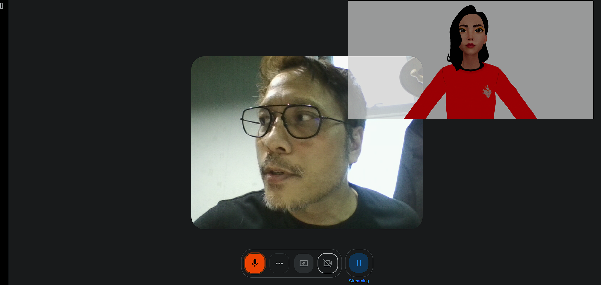
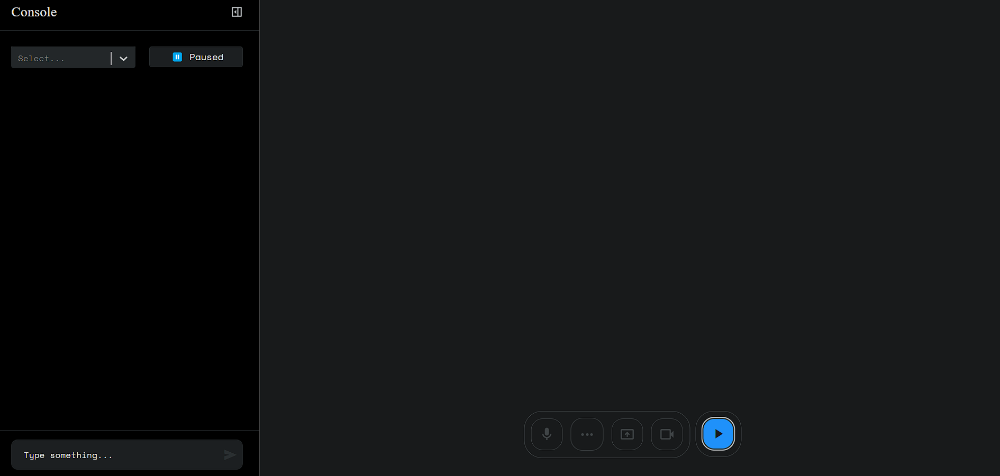
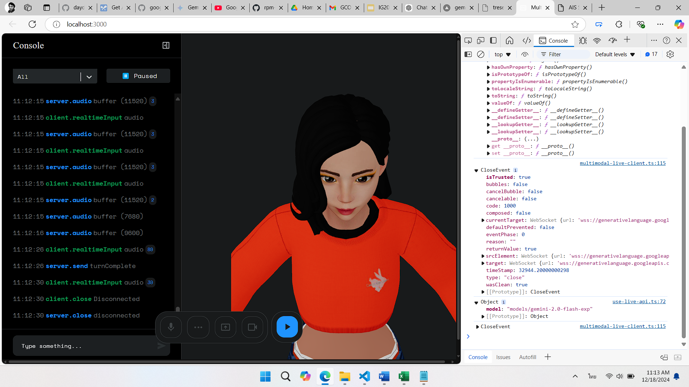

# Enhancing Gemini Multimodal Web API with Ready Player Me Avatar Blendshapes and Audio

This project builds upon the  [google-gemini/multimodal-live-api-web-console](https://github.com/google-gemini/multimodal-live-api-web-console) repository, integrating Ready Player Me avatar blendshapes with the Gemini Multimodal Web API and Audio Web API to create a more interactive and engaging user experience.

**Features:**
* **Real-time avatar animation:**  Drive your Ready Player Me avatar's facial expressions using the audio input processed by the Gemini Multimodal Web API.
* **Seamless integration:**  Combines the power of Gemini's multimodal capabilities with the flexibility of Ready Player Me avatars.
* **Easy setup:** Get started quickly with clear instructions and minimal configuration.
* **Deployable:** Build and deploy your project easily on Vercel.
Test the demo of the Multimodal Live API with Ready Player Me [https://geminiwebapi.vercel.app/](https://geminiwebapi.vercel.app/).

**Getting Started:**
1. **Clone the repository:** `git clone https://github.com/your-username/your-repo-name.git`
2. **Install dependencies:** `npm install`
3. **Obtain your Gemini API Key:**
    * Go to Google AI Studio.
    * Sign in with your Google account.
    * Create an API key.
4. **Set up your environment variables:** Create a `.env.local` file and add your Gemini API Key: GEMINI_API_KEY=your_api_key_here
5. **Run the development server:** `npm run dev`
6. **Access the application:** Open your browser and go to `localhost:3000`.

**Building and Deploying:**
* **Build the application:** `npm run build`
* **Deploy on Vercel:** Follow the Vercel deployment instructions.

**Technology Stack:**
* **Gemini Multimodal Web API:**  Google's powerful AI model for processing and generating multimodal content.
* **Ready Player Me:**  Platform for creating customizable avatars.
* **Audio Web API:**  Provides access to audio input and output for web applications.
* **React:**  JavaScript library for building user interfaces.

  

**Acknowledgements:**
* **Google AI:** For developing the Gemini Multimodal Web API and the [multimodal-live-api-web-console](https://github.com/google-gemini/multimodal-live-api-web-console) repository.
* **Ready Player Me:** For providing the avatar platform.

**Author:**

Asst. Prof. Banyapon Poolsawas  
Dhurkij Pundit University

**License:**

[Apache-2.0 license](https://github.com/banyapon/readyplayerme-gemini-multimodal-api/tree/main#Apache-2.0-1-ov-file)
